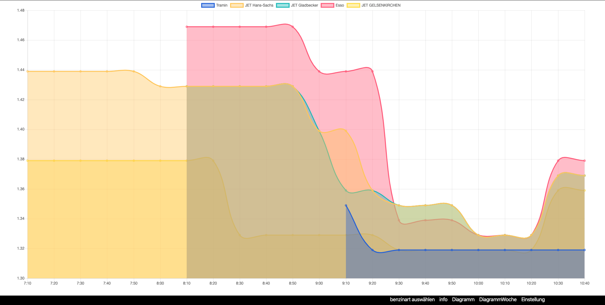
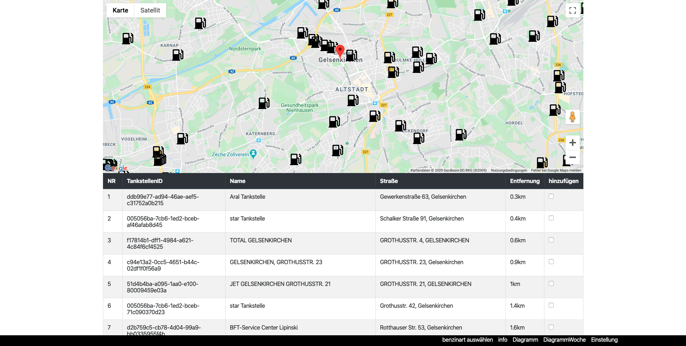
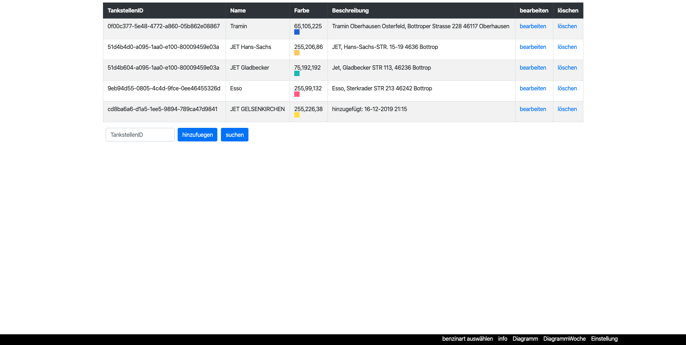

# Tankpreise
Tankpreise ist ein Projekt, um sich immer die aktuellen Benzinpreise anzeigen zu lassen. Es gibt zusätzlich Graphen, um sich den Verlauf der Preise Grafisch anzeigen zu lassen.

Badge | Status
--- | ---
test | 
test | 
test | 
test | 
test | 
test | 
test | 
test | 
test | 
test | 
---

## Screenshots
<table>
    <tr>
        <td>
            
        </td>
        <td>
            
        </td>
        <td>
            
        </td>
    </tr>
</table>

## Voraussetzungen:
Um die Webanwendung selber zu benutzen benötigst du:

- Eine Datenbank deiner Wahl
- Einen Webserver mit PHP
- API-Key's für die eingebundenen Dienste

## Installation
Lade dir den [letzten Release](https://github.com/Assassinee/Tankpreise/releases/latest) herunter und kopiere die Daten auf deinen Webserver. Bei dem ersten aufrufen der Webanwendung wirst du automatisch durch den Einrichtungsprozess  geführt.

[direkter Download](https://github.com/Assassinee/Tankpreise/releases/latest/download/asset-name.zip)

## Dienste:
Aktuell werden folgende Dienste von dieser Webanwendung unterstützt.

### Karte:
Wird für die Anzeige der Tankstellen auf einer Karte benötigt.
- [Google Maps](https://developers.google.com/maps/documentation/javascript/tutorial?hl=de)

### Geocoding:
Wird für die Übersetzung von einer Adresse in Koordinaten benötigt.
- [Google Geocoding](https://developers.google.com/maps/documentation/geocoding/start)

### Benzindaten:
Wird für die Abfrage der Benzinpreise benötigt.
- [Tankerkoenig](https://creativecommons.tankerkoenig.de/)

## Autor
- [Maximilian Kosowski (Assassinee)](https://github.com/Assassinee)

## Lizenz
Dieses Projekt verwendet die [GNU AGPLv3](LICENSE) GNU Affero General Public License v3.0 - schau dir die [LICENSE.md](LICENSE) Datei für mehr Details an.
